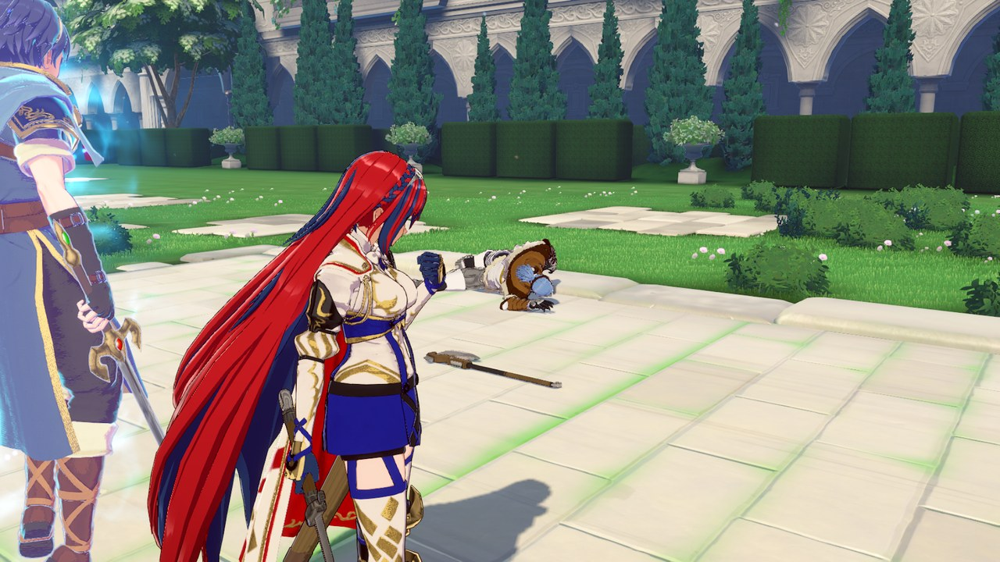
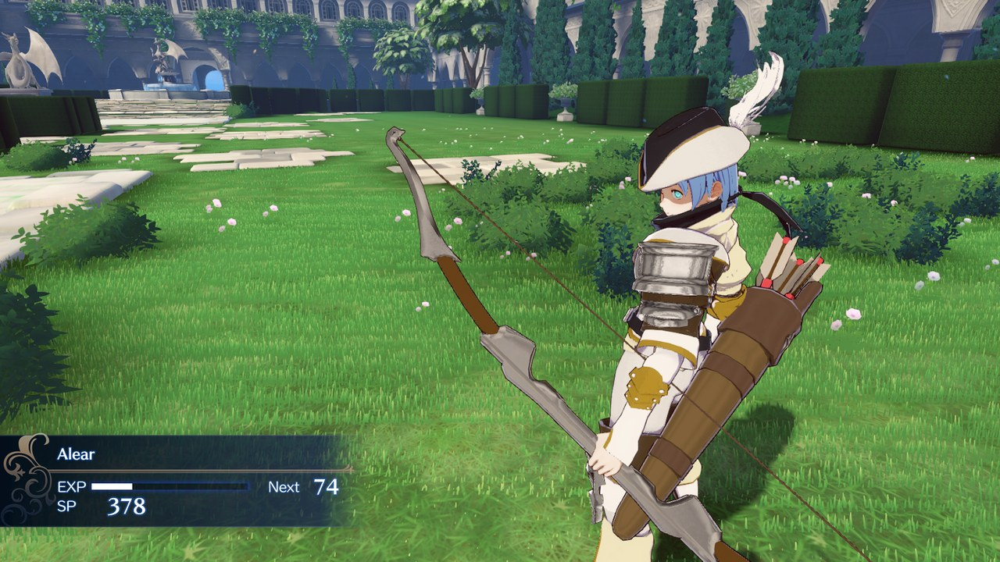
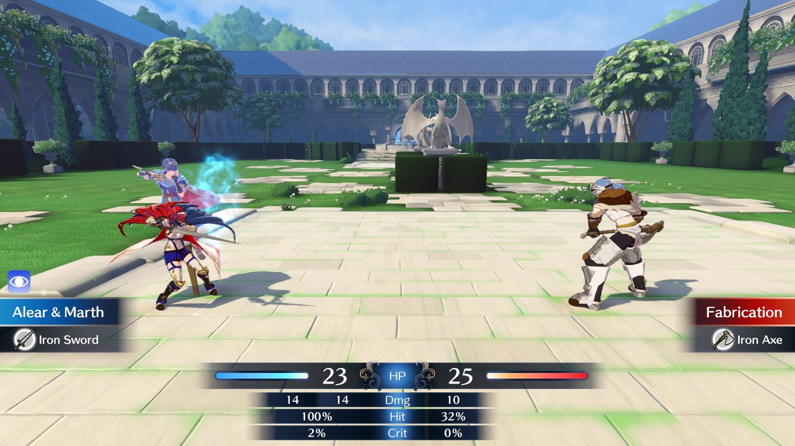
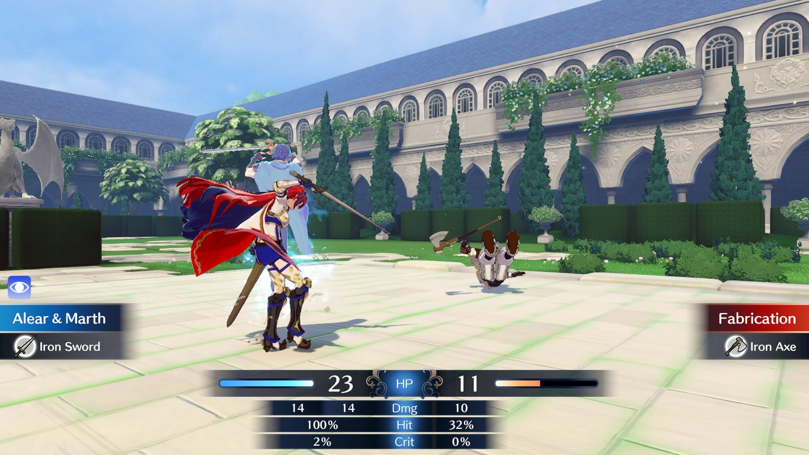
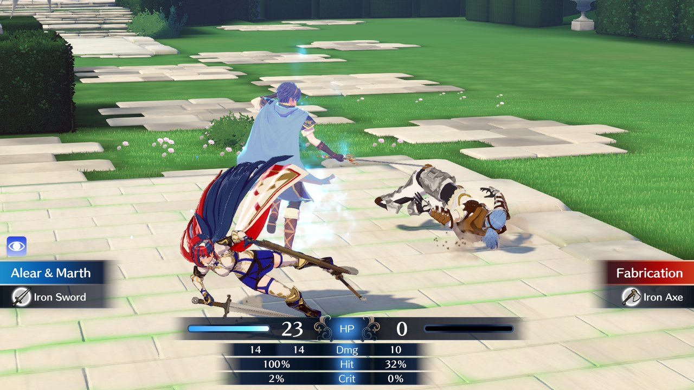
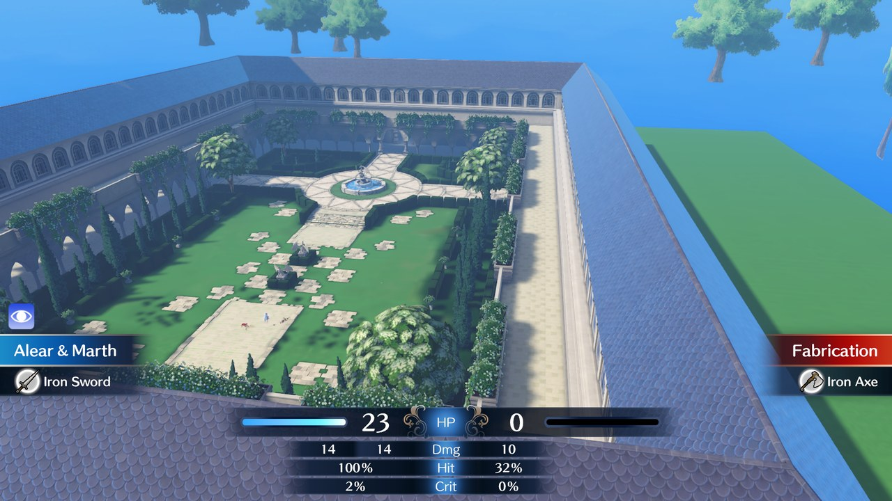
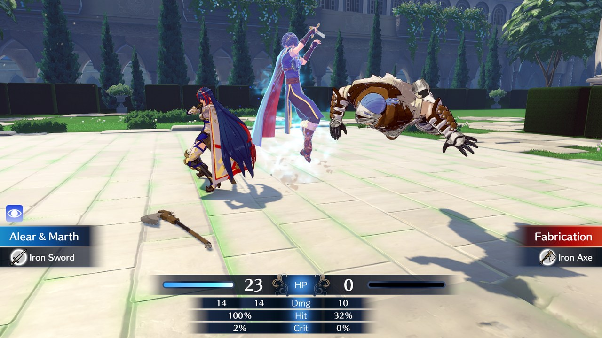

# Combat Camera

A camera mod for Fire Emblem Engage!

## Kills stop and wait for you

When a character dies the battle holds on the finishing shot instead of moving on by
itself. The camera sits behind the one who died, looking at the winner. Press A when you
are done looking.

Bodies stay on screen too, so you can see your handywork.



Press ZR or ZL to querry throgh camera views. 



## Switch cameras mid fight

Press ZR or ZL during a battle to pick a different angle. The game stops changing camera
on its own and keeps the one you chose.





Press X to give control back to the game.

Criticals, Engage attacks, chain attacks, cannon shots and dragon transformations still
play their own camera.

## Free camera

Press Minus to activate free-cam. Left stick moves, right stick looks.
Nothing is locked, you can go anywhere and point it any way.
It also freezes the game.




Press Minus again to unfreeze.

## Controls

| Button | In a fight | While a kill is held | Free camera |
|---|---|---|---|
| ZR | next camera | next camera | |
| ZL | previous camera | previous camera | |
| X | back to normal camera | back to the finish shot | |
| Minus | freeze and fly | freeze and fly | exit |
| A | | continue | |
| Left stick | | | move |
| Right stick | | | look |

## Before you install

You need two things.

**Fire Emblem Engage version 2.0.0.** No other version works.

**Cobalt**, the mod loader.
Download: https://github.com/Raytwo/Cobalt/releases/latest
Install guide: https://github.com/Raytwo/Cobalt/wiki/Installing-Cobalt

## Install

1. Download the `Combat Camera` folder from this repo.
2. Copy it into your `engage/mods` folder.

On Ryujinx that folder is:

```
%APPDATA%\Ryujinx\sdcard\engage\mods\
```

On a Switch it is on the SD card:

```
sd:/engage/mods/
```

You should end up with:

```
engage/mods/Combat Camera/libdeath_hold.nro
```

Start the game. That is it.

## Turning it off

Put a dot in front of the folder name:

```
engage/mods/.Combat Camera/
```

Cobalt skips any folder starting with a dot. Remove the dot to turn it back on.

## Good to know

- B still skips a battle like normal, and skips the hold with it.
- Corrupted enemies still dissolve. They use a different system.
- Only battle scenes are affected. Deaths from poison, staves or story events are not.
- Turn battle animations on, or there is no battle scene to change.

## License

MIT. Do what you like with it.
